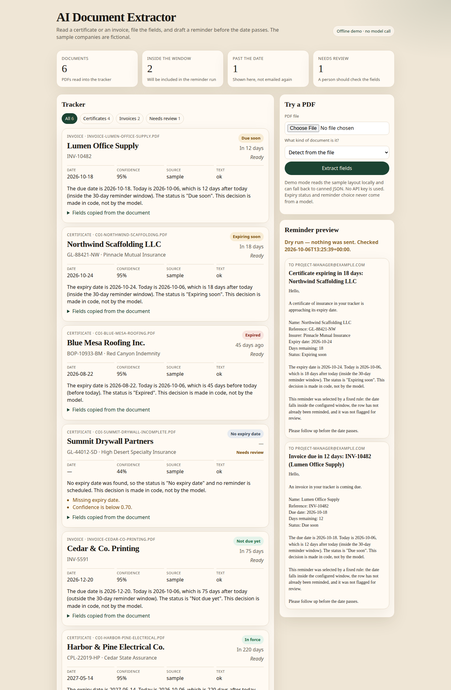
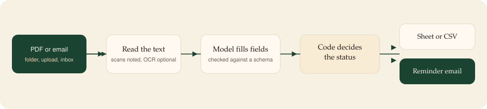
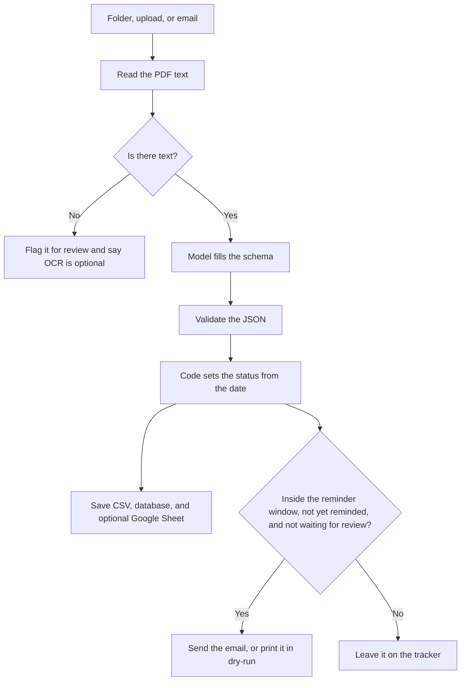

# AI Document Extractor

[](https://www.python.org/downloads/)
[](LICENSE)

A small tool that reads insurance certificates and invoices, files the important fields, and drafts a reminder before a date passes.

It is a working sample of an automation you can run on your own computer. The companies in the sample files are fictional. Nothing here is a real policy or a real bill.



This is the tracker after the offline demo. Amber is inside the reminder window, red is already past, green is not due yet, and the missing date is flagged for a person.



## The problem

Subcontractor insurance certificates arrive as PDFs. Someone has to type the company, the policy number, the insurer, the coverages, and the expiry date into a spreadsheet, then remember to ask for a new certificate before it lapses.

Invoices have the same shape of work: vendor, invoice number, line items, total, and a due date.

The typing is slow, and the reminder is easy to miss. The useful part is not a chat window. It is a row in a sheet, a clear status, and an email that goes out on a schedule.

## What it does

1. Takes a PDF from a folder, an upload, or an email attachment.
2. Reads the text in the file.
3. Asks a model to copy the fields into a fixed shape. In the offline demo, a local stand-in does this with no API key.
4. Checks the fields. If something required is missing, the row is marked **Needs review**.
5. Decides the status from the date. That decision is ordinary code, not the model.
6. Saves the row to a CSV file and a local database. Google Sheets is optional.
7. Once a day, finds rows that fall inside your reminder window and writes the email. The demo prints those emails instead of sending them.

Two document types are included:

| Type | Fields it keeps | Date it watches |
| --- | --- | --- |
| Certificate of insurance | Company, policy number, insurer, coverages, limits, effective date, expiry date | Expiry date |
| Invoice | Vendor, invoice number, invoice date, due date, line items, total | Due date |

You can add another type the same way. See [Adapt it](#adapt-it-to-another-document).

## How it works



A 30-day window means:

- the date is before today → **Expired** or **Past due** (shown on the tracker, not emailed)
- the date is today, or up to 30 days away → **Expiring soon** or **Due soon** (this is the email)
- the date is further away → **In force** or **Not due yet**
- the date is missing → **No date**, and the row needs a person

The sample set is built so that, on the day you generate it, you can see one of each.

## Quick start

You need either Docker, or Python 3.11 or newer.

**One command with Python:**

```bash
make demo
```

That creates a local environment, writes fictional PDFs, reads them, and prints a table plus the reminder emails. It does not call a model and it does not send mail.

Then:

```bash
make serve
```

Open [http://127.0.0.1:8741](http://127.0.0.1:8741). The page lists every row, color and a written status together, and shows the emails that would have been sent.

**Or with Docker:**

```bash
docker compose up --build
```

Same demo, at [http://127.0.0.1:8741](http://127.0.0.1:8741). The container refreshes the sample dates when it starts, so the “due soon / already expired” mix still makes sense later.

Results are written to:

- `data/extractions.csv`
- `data/extractor.db`
- `data/reminder_preview.txt`

## What you should see

| Document | What is going on |
| --- | --- |
| Northwind Scaffolding LLC | Certificate expires inside 30 days. A reminder is drafted. |
| Harbor & Pine Electrical Co. | Certificate is still in force. No email. |
| Blue Mesa Roofing Inc. | Certificate is already expired. It stays on the tracker in red. No “coming due” email. |
| Summit Drywall Partners | The expiry date was not on the certificate. The row is flagged for review. No email. |
| Lumen Office Supply | Invoice is due inside the window. A reminder is drafted. |
| Cedar & Co. Printing | Invoice is not due yet. No email. |

## Configuration

Copy `.env.example` to `.env` when you want a real model, a real sheet, or real email. You can turn on one piece at a time. The demo ignores missing keys and keeps writing the CSV.

| You want | What to set |
| --- | --- |
| Still the offline demo | Leave `LLM_PROVIDER=mock` and `REMINDER_DRY_RUN=true`. |
| OpenAI | `LLM_PROVIDER=openai` and `OPENAI_API_KEY`. |
| Anthropic | `LLM_PROVIDER=anthropic` and `ANTHROPIC_API_KEY`. |
| Google Sheets | A service-account JSON file, `GOOGLE_SHEET_ID`, and share the sheet with the service-account email. |
| Real reminder email | `REMINDER_DRY_RUN=false`, `SMTP_HOST`, `SMTP_USER`, `SMTP_PASSWORD`, `REMINDER_TO`, `REMINDER_FROM`. |
| A different window | `REMINDER_DAYS=14` (or whatever you use). |
| Watch a folder | `WATCH_ENABLED=true`. Drop PDFs in `inbox/`, or in `inbox/coi` and `inbox/invoice`. |
| Read an inbox | `IMAP_HOST`, `IMAP_USER`, `IMAP_PASSWORD`, then `doc-extractor poll-inbox`. |
| Tell someone when a file fails | `ALERT_WEBHOOK_URL`. Slack incoming webhooks take `{"text": "..."}`. For Telegram set `ALERT_WEBHOOK_TYPE=telegram` and `TELEGRAM_CHAT_ID`. |
| Scanned PDFs | See below. Leave this off for the demo. |

The daily check runs while the web app is up, at 08:00 UTC, when `SCHEDULER_ENABLED=true`. `make serve` turns that on. You can also run it once with:

```bash
doc-extractor remind --dry-run
doc-extractor remind --send
```

`--send` really sends mail. Do not use it until SMTP is set.

### Scanned PDFs

The sample files have real text, so they do not need OCR.

If a PDF is only a picture of a page, the app still saves a row, marks it for review, and explains that there was no text layer. It does not pretend to have read the fields.

OCR is optional:

1. Install the Tesseract program on the machine.
2. `pip install "ai-document-extractor[ocr]"`
3. Set `OCR_ENABLED=true`.

Until you do that, a scan is a review row, not a silent failure.

### Google Sheets, the model, and email

- **Sheets.** Create a Google Cloud service account, download the JSON key, and share the spreadsheet with the service-account email (the one that looks like `something@project.iam.gserviceaccount.com`). Set `GOOGLE_SERVICE_ACCOUNT_FILE` and `GOOGLE_SHEET_ID`. If those are empty, the CSV and the database are still updated and the app logs that Sheets was skipped.
- **Model.** OpenAI is called with structured output (`json_schema`, strict). Anthropic is called with a tool whose input is the same schema. The schema files are `schemas/coi.schema.json` and `schemas/invoice.schema.json`. A bad response is retried. The model is told not to decide status or reminders.
- **Email.** SMTP with STARTTLS. Dry-run is the default, including in Docker.

## Adapt it to another document

1. Add a JSON schema next to the two that are already in `schemas/`.
2. Add a Pydantic model and a `SchemaSpec` in `src/doc_extractor/models.py`. Say which field is the date to watch.
3. Teach the mock reader the labels, or rely on the live model for unseen layouts.
4. Drop a sample PDF in `samples/` named so the type is obvious (`coi-...` or `invoice-...`), or pass `--schema` when you process a file.

The reminder rule does not need to change: it uses whatever date the schema points at.

A vendor form, a W-9 packet, or a license renewal is the same shape of project. The model copies the fields. Your code decides what “due” means.

## Try one file

```bash
doc-extractor process path/to/file.pdf --schema coi
doc-extractor process path/to/invoices --schema invoice
```

Or use the form on the dashboard. The API is the same work, for another system to call:

- `GET /api/health`
- `GET /api/documents`
- `POST /api/documents` with a PDF upload and a `schema_name` of `auto`, `coi`, or `invoice`
- `POST /api/reminders/run?dry_run=true`
- `GET /extractions.csv`
- interactive docs at `/docs`

There is no login. Do not put this on the public internet as it stands.

## n8n or this code?

Both are in the repo. The importable workflow is `n8n/ai-document-extractor.workflow.json`. The short guide is [n8n/README.md](n8n/README.md).

Use **n8n** when the team will edit the steps visually and the job is “email in, model, sheet, mail out.”

Use **this Python service** when you want tests, retries, a review flag the model cannot wave away, more than one document type, and a demo that runs before anyone creates an API key.

## Technical notes

Python 3.11+, FastAPI, and a Typer CLI. PDF text comes from pdfplumber, with pypdf as a fallback. SQLite is the source of truth. Every save rewrites `data/extractions.csv` with the same columns a Google Sheet would get.

Important decisions that are **not** left to the model:

- expiry and due status (`src/doc_extractor/status.py`)
- which rows get a reminder (`src/doc_extractor/reminders.py`)
- raising **Needs review** when a required field is missing, a certificate’s effective date is after its expiry, an invoice’s lines do not add up, or confidence is below 0.70 (`src/doc_extractor/review.py`)

The model may set `confidence` and `needs_review`. Code can turn the review flag on. It does not turn the flag off if the model already asked for a person to look.

Logs are one JSON object per line. A failed file can POST to a Slack or Telegram webhook. The webhook is skipped, not fatal, when it is unset.

Sample PDFs are drawn with ReportLab by `make samples`. Dates are relative to that day. If you open the project months later and every certificate looks expired, run `make samples` and `make demo` again.

### Tests

```bash
make test
```

The tests build their own PDFs, check the date boundaries, check that a confident-but-wrong model response still gets flagged, and check that a blank PDF never calls the extractor.

### Project layout

```
src/doc_extractor/     application code
  cli.py               demo, process, remind, serve, watch, poll-inbox
  app.py               dashboard and HTTP API
  pipeline.py          text → model → review → status → save
  llm.py               mock, OpenAI, Anthropic, retries
  status.py            date status
  reminders.py         who gets an email
  storage.py           SQLite and CSV
  sheets.py            optional Google Sheets
schemas/               JSON schemas sent to the model
samples/               fictional PDFs and canned JSON
n8n/                   workflow export and the n8n vs code note
tests/                 pytest
```

### Commands

| Command | What it does |
| --- | --- |
| `make demo` | Offline run on the sample PDFs. |
| `make serve` | Dashboard at port 8741, with the folder watch and the daily job. |
| `make test` | Unit tests. |
| `make samples` | Rebuild the fictional PDFs. |
| `make up` | `docker compose up --build`. |
| `doc-extractor process FILE` | One file or a folder. |
| `doc-extractor remind --dry-run` | Print today’s reminder emails. |
| `doc-extractor poll-inbox` | One IMAP check. |

## License

MIT. See [LICENSE](LICENSE).
